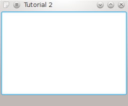

Bir Pencere Oluşturmak
-----------------------

Giriş
^^^^^^

Önceki örneğimizde uygulamamız bir iletişim kutusu gösteriyordu sadece. Şimdi yapacağımız örnekle daha işlevsel bir uygulama geliştirme yolunda adımlar atacak ve ``KXmlGuiWindow`` sınıfına giriş yapacağız.

Kod
^^^

KXmlGuiWindow, menü çubukları, araç çubukları, durum çubuğu ve büyük bir parçacık için merkezde geniş bir alan ile tam bir ana pencere görünümü sunar. Örneğin help-menu önceden tanımlanmıştır. Çoğu KDE uygulaması, XML dosyalarıyla menü ve araç çubuğu düzenlerini tanımlamak için kolay bir yol sağladığı için bu sınıftan elde edilir. ``XMLGUI`` denen bu teknolojiyi bu örneğimizde kullanmayacak olsak da ilerideki uygulamalarımızda kendisinden yararlanacağız.

İşe yarar bir KXmlGuiWindow'a sahip olmak için onu alt sınıflamamız gerekir. Bu yüzden ``mainwindow.cpp`` ve ``mainwindow.h`` olmak üzere kodlarımızı içerecek iki dosya oluşturacağız.

mainwindow.h dosyamızın içeriği aşağıdaki gibi olacak:

.. literalinclude:: 01/mainwindow.h
   :language: c++
   :linenos:

İlk önce KXmlGuiWindow'u ``MainWindow : public KXmlGuiWindow`` sınıfıyla alt sınıflıyoruz. Sonra ``MainWindow(QWidget *parent=0);`` ile kurucuyu deklare ediyoruz. Ve son olarak da uygulamamızın en önemli kısmını oluşturacak nesneye bir işaretçi atıyoruz. ``KTextEdit`` ise otomatik imleç gizleme gibi çeşitli KDE güzelliklerine sahip genel bir zengin metin düzenleyicisidir.

mainwindow.cpp dosyasının içeriği ise aşağıdaki gibi olacak:

.. literalinclude:: 01/mainwindow.cpp
   :language: c++
   :linenos:

İlk olarak tabii ki sınıf deklarasyonlarını içeren başlık dosyasını kaynak koda dahil ediyoruz. ``textArea = new KTextEdit();`` ile metin düzenleyicimizi bir nesne ile ilklendiriyoruz. Sonra KXmlGuiWindow'un KXmlGuiWindow'a pencerenin orta bölümünde ne görüneceğini söyleyen dahili ``setCentralWidget()`` fonksiyonunu kullanıyoruz. En son olarak da öntanımlı menü çubuklarını oluşturan ve daha pek çok sahne arkası iş gerçekleştiren ``KXmlGuiWindow::setupGUI()`` çağrılıyor.

Oluşturduğumuz pencereyi çalıştırmak için birkaç satır da ``main.cpp`` dosyasına eklememiz gerekiyor:

.. literalinclude:: 01/main.cpp
   :language: c++
   :linenos:

Burada önceki örneğimizden farklı çok az şey var dikkat edebileceğiniz gibi. Oluşturduğumuz mainwindow.h dosyasını kaynak koda dahil ediyoruz, ``MainWindow* window = new MainWindow();`` ile ``MainWindow`` nesnemizi oluşturuyoruz ve ``window->show();`` ile nesnemizin görüntülenmesini sağlıyoruz.

İnşa
^^^^

Uygulamaları inşa etmek için en iyi yollardan biri CMake kullanmaktır. Bu kezki ``CMakeLists.txt`` dosyasını hazırlarken nasıl birden fazla dosyanın kullanılacağını göreceğiz:

.. literalinclude:: 01/CMakeLists.txt
   :language: cmake
   :linenos:

Derleme ve Çalıştırma
^^^^^^^^^^^^^^^^^^^^^

Programlarınızı derlemek, bağlamak ve kurmak için:

.. code-block:: bash

   mkdir build
   cd build
   cmake ..
   make
   make install

Ve uygulamayı çalıştırmak için de aşağıdaki komutu kullanabilirsiniz:

.. code-block:: bash

   ./tutorial2
