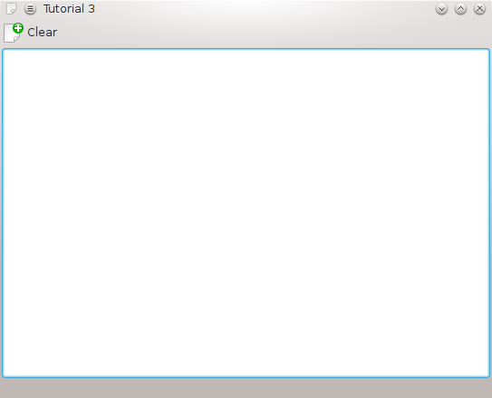

KActions Kullanımı
-------------------

Bu örnekte eylem konseptine giriş yapacağız. Eylemler kullanıcıların uygulamayla etkileşim kurmasını temin eden bütünleşik bir yoldur. Bir önceki uygulamamızda kullanıcıların araç çubuğundan bir düğmeyi tıklayarak, dosya menüsünden bir seçeneği seçerek veya bir klayve kısayolunu kullanarak metin kutusunu temizleyebilmesini sağlamak için tek bir ``KAction`` yeterli olacaktır. KAction, belli bir eylemle ilişkili simge ve kısayollar hakkında tüm bilgileri içeren bir nesnedir. Eylem daha sonra çalışmanın yapılacağı bir yuvaya bağlanır.

Kod
^^^

Öncekilere çok benzeyen bir ``main.cpp`` ile kodlamaya başlıyoruz:

.. literalinclude:: 02/main.cpp
   :language: c++
   :linenos:

``mainwindow.h`` dosyasında da öncekilerden farklı olarak sadece KAction'ın ayarlamasını yapacak olan ``void setupActions()`` fonksiyonu bulunmaktadır:

.. literalinclude:: 02/mainwindow.h
   :language: c++
   :linenos:

Şimdi ``mainwindow.cpp`` dosyasının içeriğine bakıp, kullanılan yeni ifadeleri inceleyelim:

.. literalinclude:: 02/mainwindow.cpp
   :language: c++
   :linenos:

Örneğimizde bu sefer ``MainWindow`` için olan kurucu ``setupGUI()`` yerine ``setupActions()`` fonksiyonunu çağırmakta. setupActions() fonksiyonunda KAction ile ilgi kodlar bulunmaktadır, en sonunda da setupGUI() çağrısı vardır.

KAction'ın kurulumu birkaç adımdan oluşmakta. İlk önce KAction kütüphanesi ``#include <KAction>`` ile kaynak kodda içeriye aktarılıyor. Daha sonra da ``KAction* clearAction = new KAction(this);`` ile  ``clearAction`` isminde yeni bir KAction nesnesi oluşturuluyor.

Artık bir KAction nesnemiz var, ayarlarını gerçekleştirmeye başlayabiliriz. ``clearAction->setText(i18n("&Clear"));`` ile menüdeki girdinin ve araç çubuğundaki simgenin metnini ayarlıyoruz.

Burada metni i18n() fonksiyonundan geçirdiğimi fark etmişsinizdir, bu arayüzün diğer dillere de çevrilebilmesi için zorunludur. Eylem metninde bir adet & işareti de bulunmalıdır. Bu latin1 dışındaki dillere çeviri işlemini kolaylaştırır, kaynak metinde & işareti olmaksızın çevirmenler & işaretini eklemelerinin gerekip gerekmediğini bilemezler.

Eylem bir araç çubuğunda görüntülencekse eylemi temsili eden bir simge kullanılması iyi olacaktır. ``clearAction->setIcon(KIcon("document-new"));`` ile ``setIcon()`` fonksiyonu yardımıyla clearAction eylemine ``document-new`` simgesini atıyoruz.

Eylemimize bir klayve kısayolu atamak da son derece kolaydır. ``clearAction->setShortcut(Qt::CTRL + Qt::Key_W);`` ile eylemimize ``Ctrl + W`` kısayolunu atıyoruz.

XMLGUI'nin bir eyleme erişebilmesi için eylemin, uygulamanın eylem koleksiyonunda bulunması gerekir. Eylem koleksiyonuna ``actionCollection()`` fonksiyonuyla erişilebilir ve ``actionCollection()->addAction("clear", clearAction);`` biçiminde kullanılabilir. Burada clearAction eylemi koleksiyona eklenmiş ve ``clear`` ismi verilmiştir. clear ismi sadece XMLGUI tarafından iç işlerde kullanıldığı için yerelleştirilmemelidir.

Bütün ayarlamaları yapılmış eylemimiz hazır durumda. Şimdi işe yarar bir şeylere bağlantısını yapmamız gerekiyor. Örneğimizde metin alanına girilen yazıların temizlenmesini istediğimizden eylemimizi ``KTextEdit``'in ``clear()`` fonksiyonuna bağlıyoruz. clear() da şaşırtıcılıktan uzak bir şekilde KTextEdit'in temizliğinden sorumlu fonksiyon elbette.

Hemen hemen bütün KDE uygulamalarında bulunan ``quite``, ``save``, ``load`` gibi işlemler için KStandardAction üzerinden kullanılabilecek önceden oluşturulmuş eylemler vardır. Örneğin ``KStandardAction::quit(kapp, SLOT(quit()), actionCollection());`` ile çıkış için kullanılacak eylemi, doğru simge, metin ve kısayolla kolayca oluşturuyoruz.

Şu anda temizleme yapacak eylemimiz oluşturuldu ancak herhangi bir menü veya araç çubuğuyla ilişkilendirilmedi. Bu ilişkilendirmeyi yapmak için birbirinden güzel hareketli araç çubukları oluşturan XMLGUI'yi kullanacağız.

KXmlGuiWindow'daki setupGUI() fonksiyonu grafik kullanıcı arayüzünü oluşturmak için XML dosya açıklamalarını ayrıştıran XMLGUI sistemine bağlıdır.

XML dosyalarını isimlendirirken uygulamaismiui.rc kalıbı kullanılmalıdır. Bu örneğimizde uygulama ismimiz ``tutorial3`` olduğu için XML dosyamızın ismi de ``tutorial3ui.rc`` olarak yazılmıştır:

.. literalinclude:: 02/tutorial3ui.rc
   :language: xml
   :linenos:

<Toolbar> etiketi genellikle pencerenin en üstünde yer alan ve üzerinde çeşitli eylemlere atalı simmeler bulunan araç çubuğunu tanımlamanıza izin verir. Burada ``<text>`` etiketiyle eşsiz ismi ``mainToolBar`` ve kullanıcıya görünen ismi ``Main Toolbar``olan bir araç çubuğu tanımlanıyor. ``<Action>`` etiketiyle de temizleme eylemi araç çubuğuna yerleştiriliyor.

Araç çubuğuna bir eylem eklemek yerine ``<MenuBar>`` etiketiyle menü çubuğuna bir girdi de eklenebilir.

.. Warning:: Son kurulumdan sonra .rc dosyası üzerinde değişiklik yaparsanız sistem bazında önbellek güncellemesi için ``<gui>`` etiketinin ``version`` özniteliğini de değiştirmeyi unutmayın. Verdiğiniz sürüm numarasın da bir tamsayı olduğundan emin olun, ondalık değer kullanırsanız çalışmayacak ve çalımadığına dair de bir uyarıda bulunmayacaktır.

Kod ve .rc dosyaları arasındaki ilişkiye biraz daha değinmek gerekirse şunlar söylenebilir: menüler otomatik olarak görünür ve standart menüler hariç hepsi <text/> alt etiketine sahip olmalıdır. Eylemler elle oluşturulmalı ve .rc dosyasında isimleriyle actionCollection()'un içine eklenmelidir. Eylemler gizlenebilir veya devre dışı bırakılabilir ama menülerde böyle bir durum yoktur.

İnşa
^^^^

Sonunda bitirdiğimiz tutorial3ui.rc dosyasını KDE'nin bulabileceği bir yere göndermemiz gerekiyor. Bu da uygulamanın bir yere kurulması gerektiği anlamına geliyor.

.. literalinclude:: 02/CMakeLists.txt
   :language: cmake
   :linenos:

Oluşturduğumuz ``CMakeLists.txt`` dosyası öncekilerden farklı olarak dosyaların nereye kurulacağını tarif eden iki ek satıra daha sahip. İlk olarak ``tutorial3`` hedefini ``BIN_INSTALL_DIR`` konumuna, daha sonra da kullanıcı arayüzü yerleşimini içeren ``tutorial3ui.rc`` dosyasını uygulamanın veri dizinine kopyalıyoruz.

Derleme ve Çalıştırma
^^^^^^^^^^^^^^^^^^^^^

Eğer KDE4'ün kurulu olduğu sistem bölümüne yazma hakkınız yoksa veya geçici bir örneği buraya yüklemek istemiyorsanız kurulumu ev dizininizde bir yere de yapabilirsiniz.

CMake'in uygulamayı nereye kuracağını söylemek için ``DCMAKE_INSTALL_PREFIX`` parametresi kullanılabilir. Örneğin aşağıdaki komutlarla ev dizinizde KDE'ninkine benzer bir dizin yapısı oluşturabilir ve kurulumu buraya yapabilirsiniz:

.. code-block:: bash

   mkdir build
   cd build
   cmake .. -DCMAKE_INSTALL_PREFIX=$HOME
   make
   make install
   $HOME/bin/tutorial3
