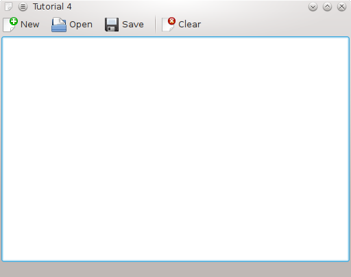

Dosya Açma ve Kaydetme
-----------------------

Giriş
^^^^^^

Önceki örneklerimizde yavaş yavaş basit bir düzenleyici arayüzü oluşturduk. Görünüşten sonra işlevsel olarak da bir metin düzenleyiciye yaklaşmak için birkaç ekleme daha yapalım şimdi de. Bir metin düzenleyici temel olarak sabit diskteki dosyaları açabilmeli, düzenlediğiniz dosyaları kaydedebilmeli ve sıfırdan yeni dosyalar oluşturabilmeli.

KDE, dosyalar üzerinde çalışmak için geliştiricilerin hayatını kolaylaştıran pek çok sınıf sunar. ``KIO`` kütüphanesi ağ şeffaf protokoller ve standart dosya iletişim pencereleri aracılığıyla dosyalara kolayca erişmenizi sağlar.

Kod
^^^
Kodlamaya önceki örneğimizdekiyle hemen hemen aynı bir ``main.cpp`` dosyasıyla başlıyoruz:

.. literalinclude:: 03/main.cpp
   :language: c++
   :linenos:

Metin düzenleyimizin dosyaları açma ve kaydetme yetenekleriyle donatmak istediğimiz için bu işleri yapacak fonksiyonlar eklemeliyiz. Fonksiyonlar Qt'nin sinyal/yuva mekanizması üzerinden çağrıldığından bu fonksiyonları yuva olarak tanımlamalıyız. Başlık dosyasında yuva kullandığımız için de ``Q_OBJECT`` makrosunu eklemeliyiz.

Ayrıca açılan dosyaları takip etmek istediğimiz için fileName isminde bir ``QString`` deklare ediyoruz.

.. literalinclude:: 03/mainwindow.h
   :language: c++
   :linenos:

Önceki örnektekinden çok da farklı olmayan bir ``tutorial4ui.rc`` oluşturuyoruz. KDE'nin kendisi halledeceği için ``KStandardActions`` eylemlerinin yerleşimi hakkında herhangi bir bilgi eklememiz gerekmiyor.

.. literalinclude:: 03/tutorial4ui.rc
   :language: xml
   :linenos:

Şimdi ``mainwindow.cpp`` dosyasını detaylıca inceleyelim:

.. literalinclude:: 03/mainwindow.cpp
   :language: c++
   :linenos:

Yaptığımız ilk şey ``MainWindow`` kurucusuna ``fileName(QString())`` ifadesini eklemek. Bu, ilk başlangıç anından itibaren fileName'in boş olmasını garanti ediyor.

Sonra ``KStandardActions`` eylemleriyle kullanıcıların uygulamaya dosyayı yüklemesini veya kaydetmesini söyleyebileceği dış arayüzü oluşturuyoruz. Eylemlerin hepsini de başlık dosyasında deklare ettiğimiz uygun yuvalara bağlıyoruz.

Oluşturduğumuz ilk fonksiyon yeni bir belge oluşturan ``newFile()`` fonksiyonu. ``fileName.clear()``, henüz belge sabit disk üzerinde kayıtlı olmadığı için fileName isimli QString'i boş olarak ayarlar. Sonra ``textArea->clear()`` da merkezi metin alanının içini temizler.

Şimdi ilk dosya işleme kodumuzun üzerindeyiz. Metin alanının içeriğini parametre olarak verilen dosya ismine kaydeden bir fonksiyon gerçekleştireceğiz. KDE dosyaları güvenle kaydetmek için Qt'nin ``QFile`` sınıfından türetilmiş ``KSaveFile`` sınıfı sunar.

``void MainWindow::saveFileAs(const QString &outputFileName)`` ile fonksiyonun prototipini, ``KSaveFile file(outputFileName);`` ile KSaveFile nesnesini oluşturuyoruz ve ``file.open();`` ile dosyayı açıyoruz.

Şimdi yazmak için hazır bir dosyaya sahibiz. Metin alanındaki metni dosyaya kaydedilebileceği şekilde biçimlendirmemiz gerekiyor. Bunun için ``QByteArray outputByteArray;`` ile bir ``QByteArray`` oluşturuyor ve ``outputByteArray.append(textArea->toPlainText().toUtf8());`` ile içini metin alanında her ne varsa onun düz metin haliyle dolduruyoruz.

QByteArray'ı ``KSaveFile::write()`` ile dosyaya yazmak için kullanacağız. Eğer normal bir QFile kullanıyor olsaydık bu değişikliklerin hemen yansımasına neden olacaktı. Bu da yazma sırasında bir hata oluşması durumunda dosyanın bozulmasına neden olur. Bu nedenle ``KSaveFile`` ilk önce geçici bir dosyaya yazar ve ``KSaveFile::finalize()`` çağrısı yaptığınızda asıl dosyada değişiklik yapar.

Burada son olarak da ``fileName = outputFileName;`` ile MainWindow'un fileName üyesini kaydettiğimiz dosyanın ismini gösterecek şekilde ayarlıyoruz.

``saveFileAs()``, saveAs yuvasına bağlanan fonksiyon. Sadece genel ``saveFileAs(QString)`` fonksiyonunu çağırır ve ``KFileDialog::getSaveFileName()`` tarafından döndürülen dosya ismini geçer.

Bu KIO kütüphanesini kullandığımız ilk an. ``KFileDialog``, genel dosya iletişim pencereleri göstermek için tüm KDE uygulamalarınca kullanılan çeşitli statik fonksiyonlar sunar. ``KFileDialog::getSaveFileName()`` çağrısı kullanıcıya dosya ismi seçebileceği bir iletişim penceresi gösterir. Fonksiyon daha sonra ``saveFileAs(QString)`` fonksiyonuna geçeceğimiz tam dosya ismini döndürür.

``saveFile()`` fonksiyonunda yeni veya heyecen verici bir şey bulunmamakta. Sadece kaydetme iletişim penceresinin gösterilip gösterilmeyeceğini belirliyor. fileName boş değilse dosya fileName'a kaydediliyor. Ama eğer boşsa kullanıcıya isim seçebilmesi için iletişim penceresi gösteriliyor.

Sonunda sabit diskten dosya yükleyebilecek duruma geldik. Bunu yapacak kodların hepsi ``MainWindow::openFile()`` fonksiyonunda bulunuyor. İlk önce kullanıcıya açmak istediği dosya ismini sormalıyız. Bunu bir başka KFileDialog fonksiyonu olan ``getOpenFileName()`` ile yapıyoruz.

Daha sonra KIO kütüphanesini kullanarak dosyayı alıyoruz. Bu bize dosyayı QFile kullanarak FTP gibi uzak bir konumda bulunsa bile açma imkanı verir.

Sonraki çağrımızı ``KIO::NetAccess::download(fileNameFromDialog, tmpFile, this)`` ile ``NetAccess's download()`` fonksiyonuna yapıyoruz. İlk argüman yüklemek istediğimiz dosyanın ismi. İkinci argüman, dosyanın yüklenmesi tamamlandıktan sonra dosyanın geçici kopyasının konumunu saklayacak bir ``QString``. Bundan sonra çalışacağımız dosya ``tmpFile``.

Bu fonksiyon transferin başarılı geçip geçmediğine bağlı olarak ``true`` veya ``false`` döndürür. Eğer başarısız olursa ``KMessageBox::error(this, KIO::NetAccess::lastErrorString());`` ile hatayı veren bir mesaj kutusu gösteriyoruz. Başarılı olursa dosyayı açarak devam ediyoruz.

``QFile file(tmpFile);`` ile geçici dosyadan bir QFile oluşturuyor ve ``file.open(QIODevice::ReadOnly);`` ile sadece okunur kipte açıyoruz.

Dosyanın içeriğini görüntüleyebilmek için bir ``QTextStream`` kullanmalıyız. Dosyamızın içeriğini yapıcısına geçerek bir tane oluşturuyor ve sonra QFile'ın ``readAll()`` fonksiyonunu çağırarak dosyadan metni alıyoruz. Daha sonra da bunu ``textArea->setPlainText(QTextStream(&file).readAll());`` ile metin alanımızın ``setPlainText()`` fonksiyonuna geçiyoruz.

Daha sonra yeni açtığımız dosyanın yolunu ``fileName = fileNameFromDialog;`` kaydediyoruz ve son olarak da ``KIO::NetAccess::removeTempFile(tmpFile);`` ile geçici dosyayı siliyoruz.

İnşa
^^^^^

Bu sefer KIO kütüphanesini de kullandığımız için ``target_link_libraries()`` fonsiyonuna ``${KDE4_KIO_LIBS}`` değerini geçerek CMake'e KIO'yu da bağlamasını söylemeliyiz.

.. literalinclude:: 03/CMakeLists.txt
   :language: cmake
   :linenos:

Derleme ve Çalıştırma
^^^^^^^^^^^^^^^^^^^^^^

Tüm dosyalarımızın yazımını tamamladığımıza göre çalıştırmak için derleyip, bağlayabiliriz:

.. code-block:: bash

   mkdir build
   cd build
   cmake .. -DCMAKE_INSTALL_PREFIX=$HOME
   make
   make install
   $HOME/bin/tutorial4

.. Note:: Değişen ayarlar KDE'nin uygulama ayarlarını sakladığı dizinde tutulur, bu örneğimizin ayarları $HOME/.kde/share/apps/tutorial4 dizininde bulunur.
